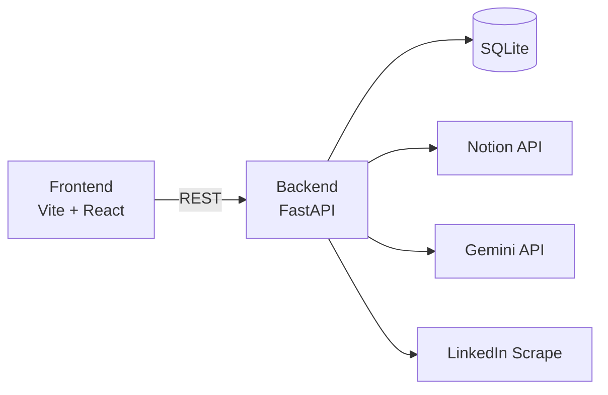

# CareerWeb

채용공고를 수집하고 Notion에 정리하며, ATS 분석까지 연결하는 간단한 작업 공간입니다.

## Architecture
- **Frontend**: Vite + React (`/Users/jay/Documents/CareerWeb`)
- **Backend**: FastAPI + SQLModel + SQLite (`/Users/jay/Documents/CareerWeb-backend`)
- **Integrations**: Notion API, Google Gemini API, LinkedIn scraping



## Flow
1. 공고 입력 (URL/제목/본문/공고일)
2. LinkedIn URL이면 자동 채움 (제목/본문/회사명/게시일)
3. 백엔드에서 중복 체크 후 DB 저장
4. 비동기 작업: LLM 파싱 + Notion 페이지 생성/갱신
5. ATS 분석 결과 Notion에 append + DB에 저장

## Key Features
- 요약 리스트 테이블 + 상세 패널
- ATS 상세 및 재분석 버튼
- 공고 수정 및 수동 채용 종료 처리
- 종료 공고 행 회색 표시 + 종료 숨기기 토글
- 정리본(LLM) + 원문을 Notion에 저장

## API (Backend)
- `POST /api/job-postings` 공고 등록(비동기)
- `GET /api/job-postings` 리스트 조회
- `POST /api/job-postings/preview` LinkedIn 자동 채움
- `PUT /api/job-postings/{id}` 공고 수정 + Notion 갱신
- `POST /api/job-postings/{id}/ats` ATS 재분석
- `POST /api/job-postings/{id}/close` 채용 종료 처리(수동)

## Environment (Backend)
`.env` 파일로 관리합니다. 아래 값들을 설정하세요.
- `NOTION_TOKEN`
- `NOTION_DATABASE_ID`
- `RESUME_NOTION_URL`
- `GEMINI_API_KEY`
- `GEMINI_MODEL`

## Run
Frontend:
```bash
cd ~/CareerWeb
npm install
npm run dev
```

Backend:
```bash
cd ~/CareerWeb-backend
python -m venv .venv
source .venv/bin/activate
pip install -r requirements.txt
uvicorn app.main:app --reload
```

## Docker (Local Dev)
```bash
cd ~/CareerWeb
docker compose up --build
```

Frontend: http://localhost:5173  
Backend: http://localhost:8000
# React + Vite

This template provides a minimal setup to get React working in Vite with HMR and some ESLint rules.

Currently, two official plugins are available:

- [@vitejs/plugin-react](https://github.com/vitejs/vite-plugin-react/blob/main/packages/plugin-react) uses [Babel](https://babeljs.io/) (or [oxc](https://oxc.rs) when used in [rolldown-vite](https://vite.dev/guide/rolldown)) for Fast Refresh
- [@vitejs/plugin-react-swc](https://github.com/vitejs/vite-plugin-react/blob/main/packages/plugin-react-swc) uses [SWC](https://swc.rs/) for Fast Refresh

## React Compiler

The React Compiler is not enabled on this template because of its impact on dev & build performances. To add it, see [this documentation](https://react.dev/learn/react-compiler/installation).

## Expanding the ESLint configuration

If you are developing a production application, we recommend using TypeScript with type-aware lint rules enabled. Check out the [TS template](https://github.com/vitejs/vite/tree/main/packages/create-vite/template-react-ts) for information on how to integrate TypeScript and [`typescript-eslint`](https://typescript-eslint.io) in your project.
